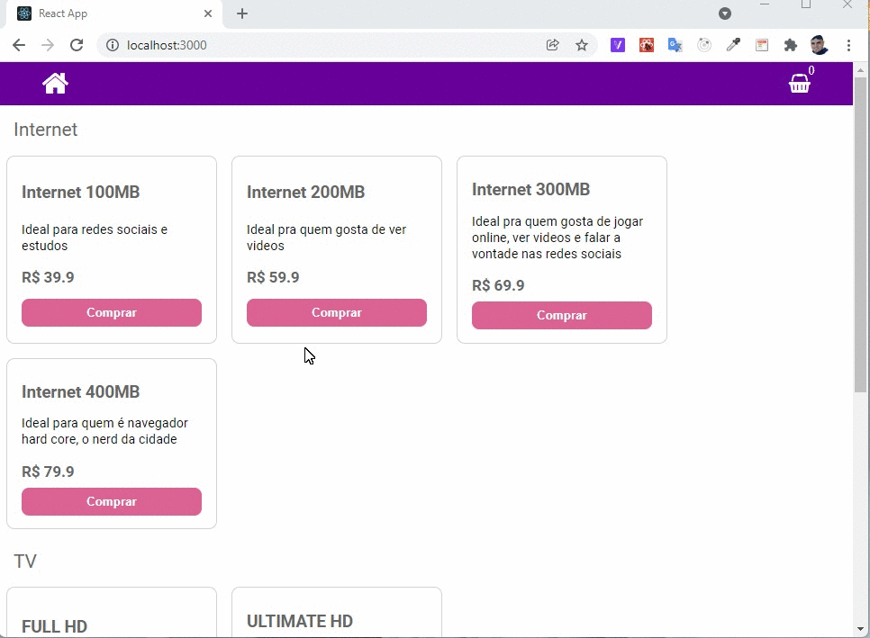

<h1 style="text-align:center"> CARRINHO DE COMPRAS </h1>

O projeto representa uma vitrine de uma loja virtual

Produtos

<ul> 
<li>TV</li>
<li>Internet</li>
<li>Fixo</li>
</ul>

 Para que o usuario possa comprar um pacote de  <strong>TV</strong> ou <strong>Internet</strong> primeiro ele precisa adquirir o plano de <strong>Telefone Fixo</strong> .

<h2>Regras:</h2>

 Para comprar um produto clique no botão de <strong>COMPRAR</strong>. Se clicar em comrar a <strong>TV</strong> ou <strong>Internet</strong> sem adquirir o<strong> Fixo</strong> o sistema vai recusar e não adicionará ao <strong> Carrinho de compras.</strong>

<h2> Anti-fraude</h2>

 Ao adiconar os itens ao carrinho e remover o <strong>Fixo</strong> o sistema excluirá todos os <strong> Produtos</strong> do carrinho.

Vou te empurrar esse <strong>Fixo</strong> de qualquer jeito!! 

<h3 style="margin-top:30px">COMO RODAR O PROJETO</h3>
<ul> 
<li>clone ou baixe o projeto</li>
<li>Abra o projeto com o editor de sua preferencia</li>
<li>Execute o comando:
  <ul> 
   <li> Yarn: yarn install </li>
   <li> Npm: npn install </li>
  </ul>
</li>
<li>Após instaladas das dependendica rode:
<ul> 
   <li> Yarn: yarn start </li>
   <li> Npm: npn start </li>
  </ul>
</li>
<li>Parabéns Você concluiu com sucesso!</li>
</ul>

<strong> </strong>